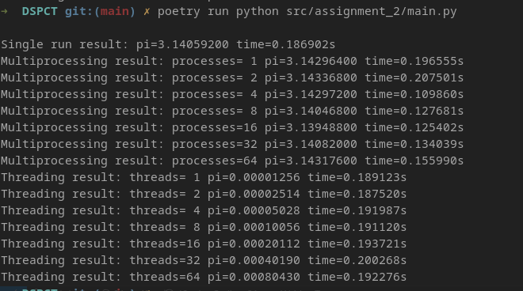

# Monte Carlo Estimation of π

Video used to learn, borrow code: [Estimating Pi using Monte Carlo Simulation](https://www.youtube.com/watch?v=VJTFfIqO4TU)

The core task is performed by the `estimate_pi` function, which simulates "rain drops" falling on a square.

---

## How It Works

* A **square** of side length 2 is centered at the origin, with a **circle** of radius 1 inscribed within it. The area of the square is 4, and the area of the circle is πr² = π.
* We focus on the **first quadrant**, where the square has an area of 1 and the quarter-circle has an area of π/4.
* **Random points (x,y)** are generated within this 1x1 square.
* A point is considered **inside the quarter-circle** if its distance from the origin is less than or equal to 1, checked using the formula: `x² + y² ≤ 1`.
* The **ratio of points inside the circle to the total points thrown** approximates the ratio of the areas:
    `(points_inside / total_points) ≈ (Area of quarter-circle / Area of square) = (π/4) / 1`.
* Therefore, we can **estimate π** using the formula: `π ≈ 4 × (points_inside / total_points)`.

---

## Performance Considerations

This calculation is **CPU-bound**, meaning its speed is limited by the processor's calculation speed, not by I/O operations.

* Since each point generation is independent, the task can be sped up using **multiple parallel processes**.
* The **optimal speed** is typically observed when the number of processes equals the number of CPU cores.
* **Higher or lower numbers of processes** can lead to worse performance due to:
    * **Overhead** in the case of too many processes.
    * **Underutilization of cores** if too few processes are used.
* There should be **no significant speedup** from using multiple concurrent threads compared to one, due to thread creation overhead and the CPU-bound nature of the task.

---

## Conclusion

The conclusion above is confirmed by the following results, considering a system with 4 cores:

